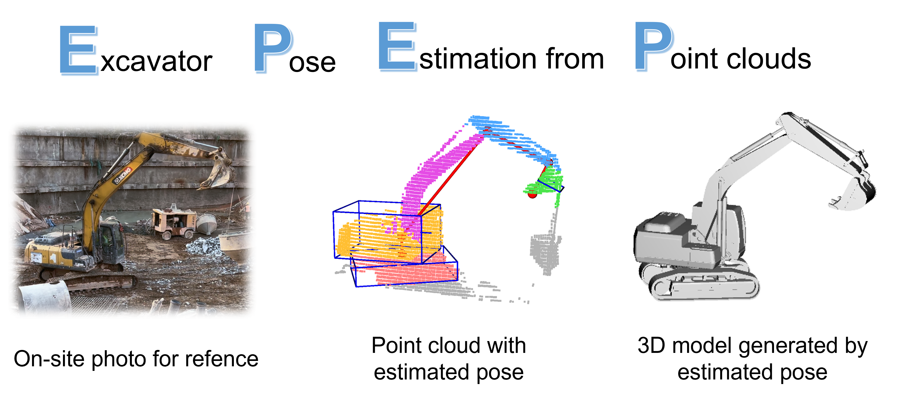
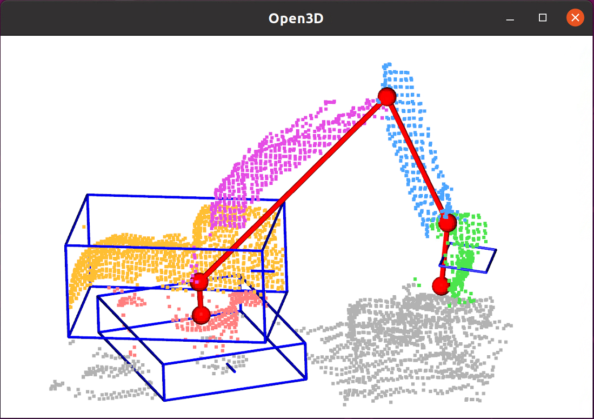

# Excavator 3D Pose Estimation from Point Cloud with Self-supervised Learning

This repository contains the source code for our paper *Excavator 3D Pose Estimation from Point Cloud with Self-supervised Learning*.



If our work is helpful to you, please cite us:
```
@article{zhang2025excavator,
  title     = {Excavator 3D pose estimation from point cloud with self-supervised deep learning},
  author    = {Zhang, M. and Guo, W. and Zhang, J. and Han, S. and Li, H. and Yue, H.},
  journal   = {Computer-Aided Civil and Infrastructure Engineering},
  year      = {2025},
  pages     = {1--19},
  doi       = {10.1111/mice.13500},
  url       = {https://doi.org/10.1111/mice.13500}
}
@software{EPEP,
  title = {Excavator 3D Pose Estimation from Point Cloud with Self-supervised Learning},
  author = {Mingyu Zhang, Wenkang Guo, Jiawen Zhang, Shuai Han, Heng Li, Hongzhe Yue},
  year = {2025},
  publisher = {GitHub},
  url = {https://github.com/fishfen/EPEP},
}
```

## Installation

Our code has been tested with
- Ubuntu 20.04
- CUDA 11.7
- Python 3.8
- PyTorch 1.13.1

1. We recommend using conda to create an environment named epep for this repository, by running the following:
    ```bash
    conda create -n epep python=3.8
    conda activate epep
    ```

2. Clone the repository:
    ```bash
    git clone https://github.com/fishfen/EPEP.git
    cd EPEP
    ```

3. Install the required packages:
    ```bash
    conda install pytorch==1.13.1 torchvision==0.14.1 torchaudio==0.13.1 pytorch-cuda=11.7 -c pytorch -c nvidia
    conda install pytorch-cluster -c pyg
    pip install -r requirements.txt
    cd utils/pointops
    python setup.py install
    ```
Generally, using updated versions of packages can also work. However, if you encounter some errors, it is likely due to version conflicts between different libraries. You can try creating a new conda environment using the package versions provided in `doc/env.yml`.
## Dataset
The structure of the data is:

```python
data/
    obj/
        x1.obj   # xxx.obj file for 3D models of excavators
        x2.obj
    realsite/    # folder for real-world data
        pointclouds/
            xx1.bin  # point cloud file
            xx2.bin
        train_labels/
            xx1.json    # labels for training
            xx2.json
        test_labels/    # labels for evaluation
        split.json  # sample names for train and test
    syn_data/    # folder for synthetic data
        labels/
            0001.json
        pointclouds/
            0001.bin
        val.txt     # sample names for validation
        train.txt   # sample names for training
```
### How to generate dataset

Set the config for data synthesis: `cfg/syn_data`

Run command to generate data: 
```bash
python synth_data.py --num_sequence 16000 --samples_per_sequence 1
```
The generated data are in `data/syn_data`. According to the test, num_sequence=16k can strike a balance between performance and computation cost. If you want to generate sequence data across time, set samples_per_sequence>1.


## Training

### Pretraining
1. Generate the synthetic dataset.

2. Set the config file: `cfg/pretrain.yaml`. Note that `train-mode` should be `supervised`.

3. To train the model, run the following command:
    ```bash
    python train.py --cfg_path cfg/pretrain.yaml
    ```

### Self-supervised fine-tuning

1. Prepare your real-world data.

2. Prepare the proxy ground truth for training data, by running `pre.ipynb`. The premise is that the pretrained model is availble.

3. Set the config file: `cfg/fine_tune.yaml`. Note that `train-mode` should be `self-supervised`.

4. To train the model, run the following command:
    ```bash
    python train.py --cfg_path cfg/fine_tune.yaml --pretrained_path ${your own path}
    ```
    Specify your own path for pretrained weights, e.g., output/base/ckpt/best_model.pth.tar

## Testing

1. Set the config file: `cfg/eval.yaml`, including the dataset `type` and `data_path`. You can also set the path for the trained model weights here.

2. To test the model, run the following command:
    ```bash
    python test.py --cfg_path cfg/eval.yaml --ckpt ${your own path}
    ```
- `--cfg_path`: Path to the testing configuration file.
- `--ckpt`: Path to the trained model checkpoint, e.g., output/base/ckpt/best_model.pth.tar.

## Demo & visualization

We have uploaded several point clouds at `data/demo_data`, and a trained model ckpt file at `output/base/ckpt/demo_model.pth.tar`. Please feel free to play with the demostration.

To run the demo, use the following command:
```bash
python demo.py --cfg_path cfg/model.yaml --ckpt output/base/ckpt/demo_model.pth.tar --data_path data/demo_data
```
It runs the trained pose estimator to estimate the pose parameters from the point clouds, and visualize the estimated pose and point cloud using Open3d.
- `--cfg_path`: Path to the model configuration file.
- `--ckpt`: Path to the trained model checkpoint.
- `--data_path`: Path of the data for the demo. Put your xxx.bin point cloud files here.

During the demo, you will be prompted to input a sample index, like:
```bash
>please input sample index in 0-4: 
```
It will then visualize the sample corresponding to your input in an Open3d window:



Drag the left key of mouse to rotate view. Press X button to continue demo. 

Press `Enter` to quit the demo anytime.


## Configuration Files

The configuration files are located in the `cfg` directory. Modify these files to change the parameters for training, testing, and demo.

- `model.yaml`: Model's base architecture and hyper-parameters.
- `pretrain.yaml`: The dataset, loss function and optimization configurations for pretraining, based on model.yaml. 
- `fine_tune.yaml`: The dataset, loss function and optimization configurations for fine-tuning, based on model.yaml. 
- `eval.yaml`: For evaluation.
- `syn_data.yaml`: For data synthesis.


## Acknowledgements

- [Pointcept](https://github.com/Pointcept/Pointcept)
- [OpenPCDet](https://github.com/open-mmlab/OpenPCDet)
- [Open3D](https://github.com/isl-org/Open3D)
